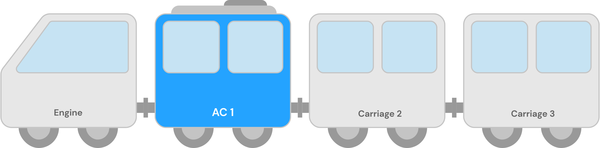

# advanced-react-concepts

[Extra link](https://dev-advanced-react-patterns-ultrasimplified.netlify.app/the-medium-clap)

## HOC & Hooks

- Both HOCs and hooks are used to encourage code reusability, but both uses very different approach at it. Here a codesandbox that illustrates that how same things can be accomplished by using different react strategies.
  [The Medium Clap](https://codesandbox.io/s/the-medium-clap-6r64hf?file=/src/components/Clap/Clap.js)

## Compound Components Pattern

- Lets consider 2 designs for trains.

  - **The First Design:** Here all the carriages are interconnected, and if person enters in any of the carriage, he/she can traverse the whole train. The train is a large lump itself.
    

    - or if we try to rephrase it in a react analogy

    ```javascript
        <Bike {...props } />
           | -> <Body {...props} />
           | -> <Chasis {...props} />
           | -> <Engine {...props} />
        // Like we return <Bike /> to the user, and user dont knows about the inner components, one single entry point and one large lump
    ```

  - **The Second Design:** Here every carriage is separated in itself, and all the components are isolated and self-contained, and the carriages are connected with each other with the help of some coupling. The train is not a large lump itself.
    

    - or if we try to rephrase it in a react analogy

    ```javascript
    <Bike>
      <Body />
      <Chasis />
      <Engine />
    </Bike>
    // All the components are exposed to the user
    ```

#### But why ?



- **Customizibility:** In the train, if we can know that certain type of people are here, then we can treat them specially, _(like it generally happens in trains)_ we can provide them with special functionalities. In React lingo, we can provide special props to different components, as per our need.
- **Understandable API:** With the first design, the implementation and working of the bike is hidden from user, `<Bike />` is like a magic to the user, but with the compound components design, everything is clear to the user.
- **Props Overload:**
  In this design architecture, if we want to pass props to `<Body/>`, then it has to go through `<Bike/>`, and is also available to other components regardless of their needs.

  ```javascript
      <Bike {...props } />
        |-> <Body {...props} />
        |-> <Chasis {...props} />
        |-> <Engine {...props} />
  ```

  But in this design architecture, we can pass specific props to the specific components, even with same names.

  ```javascript
  <Bike>                                        // --> Locomotive
    <Body seats={...} color={...} type={...} /> // ¯\
    <Chasis number={...} modelNo={...} />       //   > Carriages
    <Engine cc={...} oil={...} />               // _/
  </Bike>
  // Locomotive: We can say that all the logic stays here, and the children component are controlled by it, like select tag in html

  // <select>
  //   <option>One</option>
  //   <option>Two</option>
  //   <option>Three</option>
  // </select>
  ```

## The Control Props

- **Uncontrolled Component:** A component is an uncontrolled component, when the component is itself handling it's state (or when the DOM is controlling the state, then it is considered an higher degree of uncontrollness.)

- **Controlled Component** A component, whose state is controlled by it's parent component (or in other case, when state is handled by React, if earlier the state was controlled by DOM.)

- It is a good practice to control Form elements via controlled props.

```js
// Uncontrolled component
```
