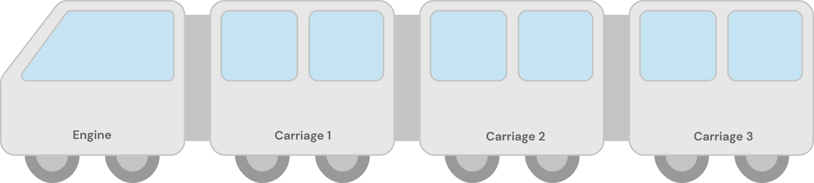
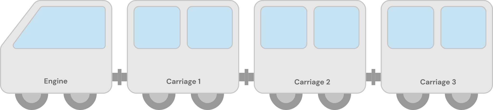

# advanced-react-concepts

[Extra link](https://dev-advanced-react-patterns-ultrasimplified.netlify.app/the-medium-clap)

## HOC & Hooks

- Both HOCs and hooks are used to encourage code reusability, but both uses very different approach at it. Here a codesandbox that illustrates that how same things can be accomplished by using different react strategies.
  [The Medium Clap](https://codesandbox.io/s/the-medium-clap-6r64hf?file=/src/components/Clap/Clap.js)

## Compound Components Pattern

## Custom Hooks
